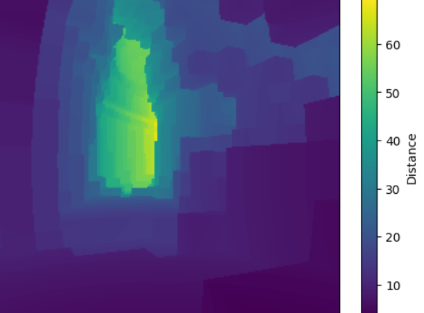

# minecraft-measurement-mod 

The Minecraft Measurement Mod allows the terrain to be measured from the player's perspective. Custom LiDAR and IMU sensors can be simulated. Cave-survey like measurements with edges and vertices are also possible. The measurement data is saved externally as CSV.

## Setup
The recommended Minecraft version is `1.20.*`.
1. Download and install [Minecraft Forge](https://files.minecraftforge.net/net/minecraftforge/forge/)
2. Download a [MMM-release](https://github.com/BaderTim/minecraft-measurement-mod/releases) that fits your Minecraft version
3. Put the `.jar` file of the Minecraft Measurement Mod in your `mods` folder in `.minecraft` (usually located here: `C:\Users\<userName>\AppData\Roaming\.minecraft`)
4. Run the game

## Example 1/2: LiDAR Measurement
This example shows a LiDAR with a horizontal and vertical field of view of 60° 
and a resolution of 240x240 distance scans running at 1Hz.

**Scene** in Minecraft:

MMM **in-game config** of *lidar1*:

**Visuaization** of *lidar1*:

**CSV file** produced by *lidar1*:

**Depth map** from the CSV file data:

## Example 2/2: Survey Measurement
This example shows a survey with multiple vertices and edges. The data is being saved into a _edges.csv_ and a _vertices.csv_ file. Each vertex has an ID and a position. Each edge has an ID, a start vertex and an end vertex. By changing the head of the survey, one vertex can be connected to multiple edges.

**Visualization** of a survey:

**Head change** of survey vertices:

